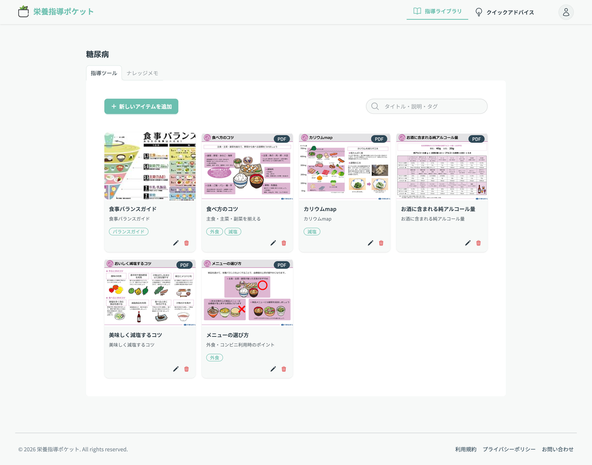
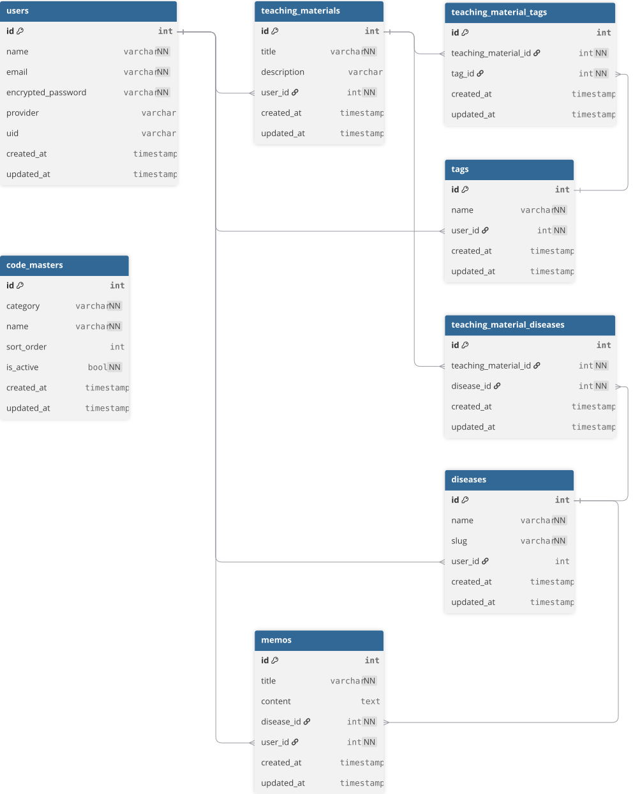

# 栄養指導ポケット

## サービス概要
栄養指導ポケットは、
限られた時間・限られた患者情報の中で即時対応を求められる調剤薬局の栄養士に向けた、
栄養指導ナレッジの管理と、患者特性に応じたクイックアドバイスを提供する栄養指導支援ツールです。

疾患別の指導媒体や栄養士自身のナレッジを一元管理できるほか、
患者の疾患・生活習慣・性格傾向といった情報をもとに、
「今日、この患者さんにどう伝えるか」を判断するための一言アドバイスを提案します。

指導の場での判断を補助し、
栄養士が本来注力すべきコミュニケーションに集中できることを目的としています。
## このサービスへの思い・作りたい理由

私は、調剤薬局で管理栄養士として栄養指導に携わってきました。
調剤薬局での栄養指導は、
患者の薬の受け取り中や短い待ち時間など、限られた時間の中で行われることが多くあります。
また、病院とは異なり、検査データや食習慣・生活習慣といった情報が十分に揃わない状態から指導を始めるケースが少なくありません。
そのような状況でも、患者一人ひとりの状況に合わせた指導が強く求められます。

しかし実際には、
- 十分な患者情報が得られないため事前準備が難しく、その場対応になりやすい

- その場対応になりやすいがゆえ、準備した指導資料を十分に活用できず、患者にとって納得感のある情報提供が難しい

- 限られた時間の中で、患者の状態・特性を把握し、「どう伝えるか」を判断するにはスキルを要し、栄養士にとって大きな負担になる

といった課題があります。

本サービスは、限られた時間・限られた情報の中でも、
患者一人ひとりの状況に合わせた情報を伝えるためのサポートとして、
栄養士の指導を補助することを目的に企画しました。

## ユーザー層について

- 調剤薬局・クリニックで栄養指導を行う管理栄養士・栄養士

## サービスの利用イメージ
1. 栄養士がログイン
2. 目的に応じて指導媒体やナレッジを確認
3. 患者の疾患・生活習慣・性格傾向などを選択
4. クイックアドバイスで、患者に合わせた一言アドバイスを確認
5. 必要に応じて、自分のナレッジメモや指導媒体を確認・編集

### クイックアドバイスの例

**高血圧 × 外食多め × めんどくさがり**

> 外食のときは、汁を残すだけで塩分を約2g減らせます。今日はそれだけ意識できれば十分です

※ 本機能は、何かを診断するものではなく、患者が気軽に「やってみようかな」と感じられるレベルのアドバイスを提供します。また、サービスのユーザーは栄養士であり、提供されたアドバイスが指導の補助的位置付けであることをUI等で示しています。

## サービスの特徴・差別化ポイント

栄養指導ポケットは、食事記録や栄養分析を行う一般ユーザー向けアプリとは異なり、栄養指導を行う側である栄養士の判断や伝え方を支援することに特化したツールです。

| サービス | 特徴 | 差別化ポイント |
|----------|------|----------------|
| あすけん | 一般ユーザー向けのダイエット・健康管理支援サービス。食事記録からカロリーや栄養素を自動計算 | **栄養士向け**の指導支援サービス。ナレッジ管理・媒体管理・クイックアドバイスで食事指導を支援 |
| カロミルアドバイス | 栄養士、指導者向け食事指導支援サービス。食事・身体データを一元管理し、記録にもとづくAIアドバイスを提供 | **指導者自身のナレッジ**を蓄積・管理し、自分専用の指導手引として活用できる |

### 推しポイント

#### 「栄養士向け」に特化したナレッジ管理

疾患ごとにナレッジや指導媒体を管理できます。

ナレッジメモでは、指導時に伝えたいことや注意点などを自分用に記録・編集でき、日常業務の中で蓄積される知識を整理できます。

#### 患者特性に応じた「伝え方」のクイック提示

疾患・生活習慣・性格傾向などを選ぶだけで、一言アドバイスを提案します。

患者一人ひとりに合わせて、「何を伝えるか」だけでなく「どう伝えるか」を考える際の補助として活用できます。

#### 自分の指導ナレッジを蓄積できる

既存のナレッジを確認するだけでなく、メモを追加・編集することで、自分自身の経験や指導時の気づきを蓄積できます。

## 現在実装している主な機能

### ユーザー認証

- ユーザー登録
- メールアドレス・パスワードによるログイン
- Googleアカウントによるログイン
- ログアウト
- アカウント削除

### 指導媒体管理

- 指導媒体の画像アップロード
- 指導媒体の閲覧・編集・削除
- タイトルによる検索
- タグによる検索

※ アップロードできる画像ファイルには5MBの上限を設けています。

### ナレッジ管理

- 疾患ごとのナレッジメモ閲覧
- ナレッジメモの作成・編集・削除
- 自分が作成したナレッジメモの管理

### クイックアドバイス

- 疾患・生活習慣・性格傾向などを選択
- OpenAI APIを利用した一言アドバイスの生成
- 患者への伝え方を考える際の補助として利用

### その他

- 利用規約ページ
- プライバシーポリシー
- お問い合わせフォーム

## 今後追加・改善したい機能

### AI APIの利用回数制限

AI機能の過度な利用を防ぐため、ユーザーごとのAI API呼び出し回数に制限を設ける予定です。

### アップロード画像の最適化

現在は画像アップロードに5MBの上限を設けています。

5MBを超える場合、ユーザー自身で画像をリサイズして再度アップロードする必要があります。

今後はアップロード時にファイルサイズを判定し、

- 5MBを超える場合：リサイズ + WebP変換
- 5MB以内の場合：WebP変換

を行うことで、ユーザーによる手動リサイズの負担を減らす予定です。

これにより、容量制限を満たした画像の保存に加え、画像容量の削減による表示速度の向上やストレージ容量の節約を目指します。

## 使用技術

### 言語・フレームワーク

- Ruby 3.2
- Ruby on Rails 7.2.3

### フロントエンド

- HTML / ERB
- JavaScript
- Tailwind CSS
- DaisyUI

### データベース

- PostgreSQL
- Neon

### 外部サービス・API

- OpenAI API
  - クイックアドバイスの生成に利用
- Google OAuth
  - Googleアカウントによるログインに利用

### インフラ・ストレージ

- Render
  - アプリケーションのデプロイ
- Neon
  - PostgreSQLデータベース
- Cloudinary
  - 指導媒体などの画像ファイルの保存

### 開発・品質管理

- Docker / Docker Compose
- Git / GitHub
- RSpec
- RuboCop
- Brakeman
- GitHub Actions

## セキュリティ・プライバシーへの配慮

本サービスでは、患者個人を特定できる情報を保存しない設計としています。

クイックアドバイス機能では、疾患・生活習慣・性格傾向など、患者個人を特定しない一般化された情報をもとにAIへリクエストを送信します。

また、AIによるアドバイスの生成結果や入力内容はデータベースに保存しません。

本サービスは診断や治療方針の決定を行うものではなく、栄養士による栄養指導を補助することを目的としています。

## 画面遷移図

[画面遷移図](https://www.figma.com/design/EcViSYfp1p8aYuw1Ote3Xf/nutrition-counseling-pocket?node-id=0-1&p=f)

## ER図

